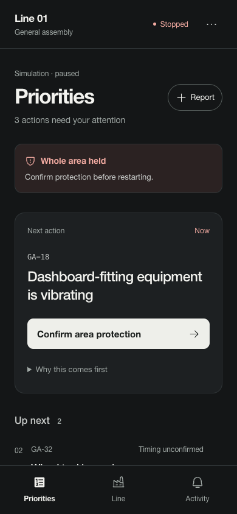

# Supervisor phone interface

The phone is organized around the supervisor's next decision. A single prominent next-action card leads the priority queue; subsequent incidents, unacknowledged requests, accepted work, and handover remain available below it. Area holds and explicit restart confirmations remain visible above the queue.

The three primary views are Priorities, Line, and Activity. Each view retains its scroll position. Workspace options contain device connection, simulation controls, and the separate audience presentation. A small source label distinguishes simulation from manual reports; a manual workspace does not claim to have a live factory feed.

Incident reports lead with the equipment and observed issue. Inspect on PC is a secondary handoff row with the report, 3D, and schematic context. Containment, named acknowledgment, follow-up, verification, and restart still use the existing shared command flow. A back control returns to the underlying view without losing its position. Activity labels distinguish requests, acknowledgment, containment, and repair progress.

## Visual system

The existing Geist typeface is retained. Matte charcoal surfaces, warm white primary actions, thin separators, and restrained 12–16px corners establish hierarchy. Color is reserved for operational status and is always accompanied by text. Phone colors are centralized in `supervisor-mobile.module.css`; desktop components retain their existing presentation.

Main text is 16px at the default text size; supporting labels are 12–14px. Phone typography uses rem units, and layouts reflow at enlarged text sizes. Buttons have at least 44px touch targets. Checkboxes use the full enclosing label as their touch target. Safe-area padding protects fixed controls. Reduced-motion preferences disable interface animations. Phone landscape remains in the lightweight phone layout and does not download 3D models.

The ui-ux-pro-max SKILL.md informed hierarchy, touch targets, semantic color, typography, and progressive disclosure. Its bundled search script was absent from the local installation, so the supplied guidance was applied directly to this existing Next.js application.

## Verification

Checked 320×568, 375×812, 390×844, and 430×932 phone sizes, plus 844×390 landscape. The queue and line view reflow at 200% root text size without horizontal overflow. Reduced motion is honored; text remains legible under both OS color-scheme preferences with the app's deliberate dark theme. Checked touch targets, the explicit containment checkbox, named acknowledgment, menu navigation, incident return navigation, and phone-to-desktop inspection. No GLB assets were fetched in the phone session, including landscape and the secondary decision-engine view.

Normal text contrast is 16.32:1 on the background; muted text is 6.90:1 on raised surfaces; the primary button is 14.74:1. Build, TypeScript, lint, and the 27 manager/supervisor workflow tests passed.

