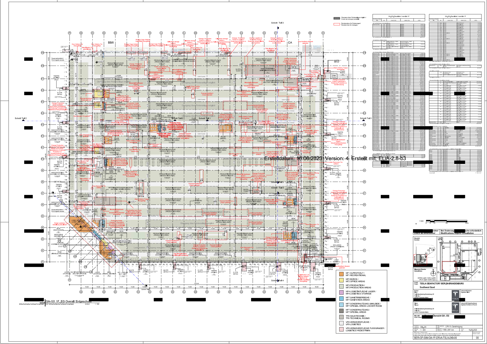
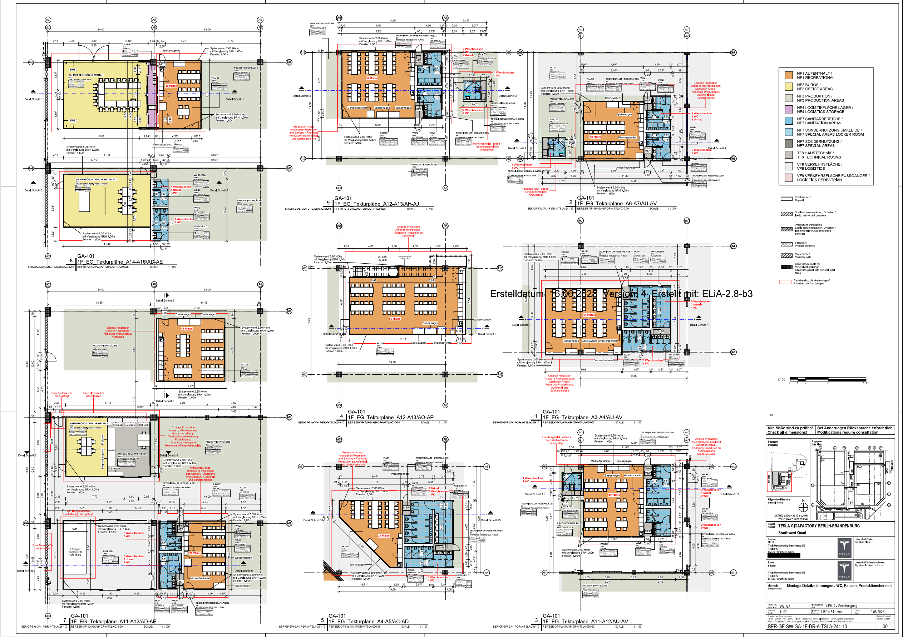

# Tesla factory fidelity audit

Research date: 26 September 2026. Reference: Gigafactory Berlin-Brandenburg, Model Y general assembly. This is a dated public-evidence baseline, not a verified 2026 as-built model.

## Finding

**Yes: public Tesla-authored site maps and interior general-assembly architectural plans exist. Neither current application view is a high-fidelity reconstruction of them.** The application is a useful synthetic incident-prioritization demonstration, but its spatial layout, station sequence and production parameters have not been validated against a Tesla line.

The strongest finding is the actual general-assembly ground-floor drawing in the 2023 application package, page **477/1424**, not a fan illustration or a drone-derived guess. The associated upper-floor drawing is page **476/1424**. The detail sheet on page **464/1424** identifies supervisor workstations and a torque-tool workshop beside production space. These are directly relevant to the environment the user wants to simulate.

This audit establishes the reference and implementation requirements. It does not replace the running application's meshes or claim that the reconstruction is complete.

## Inspected evidence

| Evidence | Exact locator | What it supports | Limit |
| --- | --- | --- | --- |
| Official regulatory record | [UVP G01423](https://www.uvp-verbund.de/trefferanzeige?docuuid=250677b6-a8f4-4850-a126-7d3ff82103ba) | Project identity; A009 final assembly distinguished from other process areas; application and decision chronology | A permitting record is not proof of today's operating configuration. |
| Tesla architectural application, Version 4 | [Pages 1–227, public mirror](https://drive.google.com/file/d/1FrR1dzas3lmkxS5zK18b1JxdlSVyhJcI/view), package pp. 14–16 and 22 | Site overview and legend; general-assembly document index | Tesla-authored documents hosted by a third party; not independently hash-matched to the original government download. |
| Tesla GA ground floor | [Pages 401–500, public mirror](https://drive.google.com/file/d/1s_3jSLxdN83wCtIuy-NyzuMkezHUcVKm/view), **PDF page 77 / package page 477**; drawing **BER-GF-SW-GA-1F-DR-A-TSLA-240-00**, revision 00 | Dimensioned architectural grid; production and logistics space; crossings; maintenance/control/support rooms | Architectural allocation, not a complete equipment installation or conveyor-routing drawing. Some information is redacted. |
| Tesla GA upper floor | Same file, **PDF page 76 / package page 476**; **BER-GF-SW-GA-2F-DR-A-TSLA-240-01** | Offices, support areas, voids and maintenance platforms | Do not flatten these into ground-floor production lanes. |
| Supervisor surroundings | Same file, **PDF page 64 / package page 464**; **BER-GF-SW-GA-1F-DR-A-TSLA-241-10** | Labeled supervisor/temp workspaces, training, break facilities and torque-tool workshop | Does not reveal the supervisor's software, staffing, dispatch rules or current work assignment. |
| GA operating-description form | Same file, **PDF page 31 / package page 431** | Identifies final assembly and seat production; points to application chapter 3.1 for work processes and equipment | The form itself does not establish a station-by-station sequence. |
| Tesla assembly photograph | [Tesla Q3 2022 update in SEC exhibit](https://ir.tesla.com/_flysystem/s3/sec/000156459022034639/tsla-8k_20221019-gen.pdf), **PDF page 16 / slide 14** | Model Y, workers beside vehicles, open-door work, dense overhead infrastructure, tools and line-side material | One dated viewpoint; cannot measure the whole factory or prove all process steps. |
| Supervisor role context | [Tesla production-supervisor description, Semi](https://www.tesla.com/sk_SK/careers/search/job/production-supervisor-general-assembly-semi-258164) | Safety, people, quality, rate/cost and coordination with engineering, quality and maintenance | Different plant/product; role context only, not Berlin-specific staffing or procedures. |

The [public archive](https://drive.google.com/drive/folders/17OJkHjqPW4LpSgNaASBlYVfK6jga_ynk) was located through a [2023 article linking the application files](https://www.electrive.net/2023/07/27/tesla-muss-plaene-fuer-gruenheide-erweiterung-anpassen/). The article was used for discovery, not as geometric evidence. The official record currently exposes the project summary but did not expose these drawing download links through the inspected page.

The GA drawings' title blocks are dated 10 May 2023; their application export footer is 16 June 2023, Version 4. Those are distinct dates. The official record lists a decision on 15 October 2024. None establishes a current 2026 as-built state. Proposed alterations and retained areas must be interpreted using each sheet's legend and revision markings.

## Reference images

These are rendered source pages, not new CAD or reconstructed floor plans. Landscape sheets were rotated for readability; redactions and revision marks are retained. Public availability does not establish an open asset license. Keep them as research references and review reuse rights before incorporating the source artwork in a distributed product.

### Actual general-assembly ground floor

### Supervisor workstation and adjacent facilities

Additional references: [site overview](giga-berlin/site-overview-2023.png), [upper floor](giga-berlin/general-assembly-upper-floor-2023.png), [Tesla's assembly photograph](giga-berlin/assembly-photo-2022.png).

## Reliability of our current implementation

These are qualitative audit judgments, not measured accuracy percentages. A numerical fidelity score would imply a ground-truth comparison we do not yet have.

| Dimension | Judgment | Evidence in our project | Consequence |
| --- | --- | --- | --- |
| 3D physical layout | **Low** | `factory-motion.ts` puts all eight checkpoints on X, at Z=0. `SingleLineModel` builds one short straight conveyor. | Does not reconstruct the dimensioned GA hall, multiple levels, material routes or supervisor work areas. |
| Vehicle fidelity | **Low for Berlin** | `FlowVehicles` uses `tesla-model-3.glb` throughout. | Wrong reference vehicle; completed cars also stand in for partly assembled bodies at early operations. |
| Equipment fidelity | **Low** | `ATTRIBUTION.md` identifies generic CC0 machinery; `factory-equipment.tsx` explicitly defines schematic authored meshes. | Machine identities, footprints, envelopes, guard boundaries and transfer interfaces are unverified. |
| Spatial coherence between views | **Low** | 3D is straight. Schematic CSS wraps eight nodes into two or four rows as panel width changes. | The schematic is a logical diagram, not a floor map. Its U-turn must not be interpreted as a real conveyor bend. |
| Process coverage | **Partial** | Eight selected operations in `config.ts`; one serial chain. | Useful for selected faults, but not evidence of the full Berlin assembly process or its exact ordering. |
| Status consistency | **A useful foundation** | Both views consume the same `StationReading` and incident ranking data and use shared station-status helpers. | Keep this shared state when rebuilding; visual agreement is not external validation. |
| Production prediction | **Synthetic / uncalibrated** | Default rate is 1 unit/minute per station; buffer capacities and initial inventories are authored assumptions. | No justified Tesla throughput, impact-time or repair-window accuracy claim. |
| Motion and WIP | **Illustrative** | Cars advance using frame delta and nearest-station speed; visual slots are independent of the simulator's fractional buffers. | Visible car counts and traversal times cannot be treated as actual WIP, takt or simulated inventory. |
| Supervisor environment | **Low** | Current representation concentrates on equipment, incidents and dispatch. | Missing the spatial context visible in the architectural plans and much of the role's people/material/quality coordination. |

### Concrete geometry problems

The checkpoint X positions are `-9.5, -4.8, 0, 2.5, 5, 7.7, 10.5, 11.5`. All eight span only **21 scene units**. The code records the car asset as **5.16 scene units long**; adjacent checkpoint spacing is **1.0–4.8 units**, always shorter than that car. That is evidence of compression, not a measured Tesla scale. It does not prove every checkpoint needs a separate vehicle-length cell, but it rules out treating these positions as validated station footprints.

The battery lift is beside the lane, with a small vertical oscillation; it does not visibly transfer a pack under a raised body. Cockpit/glass/wheel operations do not change the car's assembly state. Roller test and final inspection are separated by just one scene unit. The floor has no sourced building grid or supervisor walking route.

### Concrete schematic problems

The eight IDs (`GA-12` through `EOL-45`) are demo IDs; no mapping to the inspected Tesla plans was established. The plans use building/grid/room references, which must not be confused with those IDs. The current graph omits explicit part-feed dependencies, handoff buffers, quality hold/rework routes and transport links. Some may be outside a selected supervisor's scope, but that scope has to be defined before omission can be justified.

Do not add guessed parallel lanes or rework loops and call them Tesla-verified. They belong in a proposed process model until supported by process documentation or plant review.

### Inspection limits

The schematic was inspected in the running browser. The 3D view returned the application's “Factory view unavailable” fallback in the inspected Chrome session, so the 3D findings above come from source, asset provenance and geometry definitions, not a successful live visual comparison. Existing development logs contain navigation errors, but this audit did not establish the current failure's cause. Browser rendering must be restored and verified before a reconstruction can pass visual acceptance.

## Rebuild specification

### 1. Fix the reference and scope

Use **Berlin Model Y general assembly, 2023 public planning baseline** as the explicit initial reference. Model one defined supervisor area within GA first, retaining a hall overview for orientation. Do not blend Berlin, Texas, Fremont and future manufacturing concepts. A new-model or current-year claim requires matching evidence.

Create an evidence register for every modeled element: source, sheet/page, source date, revision, interpretation, confidence and validation status. Use three simple classes: **documented**, **inferred**, **demo assumption**. Evidence belongs in research/build metadata; the supervisor screen should carry only the concise simulation/reference context needed to interpret it.

### 2. Establish physical geometry before decorative detail

Trace the GA ground-floor boundary, column axes, documented circulation corridors, support-room footprints and selected supervisor workspace from page 477 and the detail sheets. Use dimension strings and cross-check multiple axes; do not measure meters from a PDF's resized display. Register the upper floor separately. Preserve floor elevation and access relationships.

Build one shared scene-coordinate dataset for 3D and a true top-down **floor map**. Keep a separate logical **process schematic** if desired. A schematic may compress distance, but it must preserve validated connections and must never silently imply physical adjacency.

### 3. Reconstruct the work environment

For the chosen area, include the documented supervisor workstation and relevant walking access, material staging and maintenance/support space. Use Tesla photographs to guide visual treatment of overhead services, lighting, work platforms, line-side tools and human work positions. Add correctly staged Model Y bodies and components rather than completed Model 3s everywhere.

Equipment positions and animations need their own evidence. A convincing gantry or robot does not become Tesla equipment merely by looking realistic. Use an explicitly inferred model until machine footprints and interfaces are confirmed. Prevent equipment, material carts and people from occupying the same working envelope.

### 4. Validate the production graph

Retrieve the referenced chapter 3.1 process description, then establish operation order, conveyor segments, buffers, component feeds, merges and documented quality/rework paths. Map each selected demo fault to a real operation or label it as a fictional training case. Define which upstream/downstream areas are external dependencies rather than extending the supervisor's responsibility across the whole plant.

Generate both views from that shared graph and the separate physical geometry. A stop should identify affected equipment, the constrained handoff and affected area without inventing a new fault at every starved station.

### 5. Match the supervisor's decisions

Retain the useful incident queue and equipment-state links. Add decision-relevant material cover, quality holds, current work assignment and repair ownership only when the simulation models them. Consider resource availability, access/travel and release verification: the current model allows unlimited simultaneous general-maintenance responses and therefore cannot represent competition for technicians.

Validate normal operation, a supply interruption, a tool slowdown, a quality hold and a maintenance response with a supervisor. Check what they need to locate, whom they contact and what authorizes restart. Treat those workflow requirements as proposed design until reviewed; no public floor drawing establishes Tesla's actual software or escalation policy.

## Acceptance criteria for “high fidelity”

| Gate | Required evidence |
| --- | --- |
| Spatial | Reviewed source-to-model overlay, consistent scale/grid/elevation, correctly registered supervisor area and circulation; geometric tolerance stated and checked against a measured reference. |
| Process | Reviewed adjacency/precedence graph, named external feeds, validated buffer/merge/hold boundaries; demo station IDs explicitly mapped. |
| Visual | Correct vehicle/product and assembly stages; reference-backed equipment/environment; no unexplained intersections; usable eye-level, overhead and supervisor-area views. |
| Operational | Calibrated cycle/transfer/buffer/repair inputs for quantitative claims; representative scenarios reviewed by a production expert. |
| Consistency | 3D and schematic identify the same equipment and incident; displayed WIP and motion either reconcile with simulation state or are clearly illustrative. |
| Runtime | Successful rendering and interaction checks; camera/selection survive view switches; readable states and reduced-motion behavior. |

Public material is sufficient to build a substantially more credible **dated architectural environment** now. It is not sufficient, by itself, to certify the complete current station-level digital twin. The highest-value next evidence is the selected GA area's current equipment/conveyor layout plus a supervisor walkthrough of its material, quality and maintenance decisions.

## Project files examined

- `src/components/factory-twin.tsx`: `SingleLineModel`, `FlowVehicles`, priority-scene composition.
- `src/components/factory-equipment.tsx`: authored station meshes and motion.
- `src/lib/priority/factory-motion.ts`: coordinates, spacing and representative motion.
- `src/components/production-schematic.tsx` and `.module.css`: logical graph rendering and responsive wrapping.
- `src/lib/priority/config.ts`, `types.ts`, `engine.ts`: synthetic rates/buffers, flow simulation and maintenance assumptions.
- `src/lib/priority/schematic.ts`: names and incident selection.
- `ATTRIBUTION.md`, `README.md`, `DESIGN.md`: provenance and current scope.

No runtime application code was changed by this research audit. Existing unrelated working-tree changes were preserved.

## Implemented reconstruction — 26 September 2026

The priority dashboard and audience presenter now use a common metre-based Giga Berlin scene. “Whole plant” frames the primary manufacturing buildings in their 2023 site-plan relationship; “My line” returns to the same ground-floor line inside general assembly. Camera scope never relocates the line or restarts WIP. The original `/operations` asset scene is retained.

The reconstruction uses the GA width of 310.44 m, 14 m grid, southwest chamfer, west-side supervisor context, and the department arrangement documented above. The hall depth/chamfer dimensions, building heights, room footprints, roads and surrounding site details are traced or approximated, not surveyed. Approximate metre dimensions live in `src/lib/priority/plant-layout.ts`, with provenance comments and source links.

The eight logical demo stations occupy an explicitly illustrative 150 m route in GA. Their 18 m spacing, 9 m vehicle pitch, equipment positions, contextual production islands, and visual speed are authored assumptions. None is evidence of Tesla's actual conveyor routing, takt, station numbering, WIP or staffing. Model Y-sized procedural crossover bodies (4.75 m) replace the Model 3 asset in this new scene; glass, battery and wheels appear at their demo assembly stages. They are approximate meshes, not manufacturer CAD.

The supervisor environment adds protected pedestrian lanes, crossings, overhead services and tool balancers, line-side racks/carts, workstations, HMI cabinets, guarded robot fixtures, marriage lift, roller bed and inspection arches. Detail provides human scale and recognisable work context but remains illustrative. The upper-floor architecture is not reconstructed. Other departments are exterior/context models, not simulated interiors. The on-screen “Plan reference” explains this boundary and links the evidence.

Verification covers source adjacency, the chamfered footprint, line/access clearances, vehicle spacing, arrivals/departures, pause and local stop behaviour. These checks establish internal consistency, not as-built accuracy.

The final UI also provides a floor-level camera in the supervisor aisle. The roof is cut away for elevated views and visible from inside the hall. Incident labels avoid collisions at oblique angles, prioritising incident controls over background flow labels. Floor view is a camera position, not a validated ergonomic sightline study.

Validation on 26 September 2026: production build and ESLint passed; 146 automated tests passed, including four new physical-layout/WIP tests. Browser checks covered the whole plant, GA drill-in, line/floor camera, incident selection, schematic round-trip, 1280 × 720 laptop framing and 390 × 844 mobile fallback (zero canvases; no horizontal overflow). The final production scene emitted no console errors. Verification server: localhost:3100, bound to loopback.

## Imported models and isolated focus — 26 September 2026

This update supersedes the procedural vehicle/equipment description above for the priority dashboard and audience presenter. The 3D view starts in **Focus visualization**, isolating the current manager workspace’s General assembly Line 1: eight stations, line-side equipment, material staging, walkways, workstation and incident markers. **My line** restores the surrounding hall; **Whole plant** restores campus context. Switching scopes preserves the mounted fleet and simulation. The current workspace model defines one line; this is not an invented mapping of multiple supervisors to Tesla departments.

Vehicles now use the licensed, textured Tesla Model 3 by aarajesh. Precise vertex bounds preserve proportions, normalize length to 4.694 m and ground the asset on its transport deck; transforming local bounding boxes had incorrectly lifted the vehicle. Cars travel on imported body carriers before wheel installation; glass and wheels become visible at illustrative station boundaries. A finished Model 3 mesh remains a substitute for Berlin Model Y and lacks accurate component-by-component assembly states. Carrier release and body lowering at the wheel station are illustrative transitions, not robot/conveyor kinematics.

Robot placeholders are replaced by ABB IRB 6700-200/2.60 visual geometry from ROS-Industrial, pinned to revision `45f4769d826cf3ac62a65495f2db67b78b0c81df`. Source metre geometry and URDF joint hierarchy are retained, with a demonstration pose and small station-gated motion. This is a recognizable named industrial machine, but its Tesla station assignment and end tooling are unverified.

Conveyors, skids, cockpit delivery cart, marriage lift, wheel station, dispensing equipment, roller test, inspection light tunnel and people use imported CC0 factory-pack models. The publisher describes that pack as AI-generated geometry. They are representative equipment, not supplier CAD; the dispensing model is sourced as a sealer station and only stands in for a fluids station. No visual-detail improvement upgrades these elements’ factual confidence. Source links, changes and licenses are recorded in `ATTRIBUTION.md`, `public/assets/line/sources.json` and the in-app **Plan reference → Model sources, modifications and licenses** page.

Vehicle and carrier meshes use shared geometry/materials and instanced rendering. GLBs and the Draco decoder are local assets; reflective paint/metal lighting is generated locally without a runtime HDR service. Load failures have a retry action. Scope camera bounds no longer interrupt the campus-to-line transition. Incident labels prioritize selected/urgent controls and fit available gaps between labels, fixing a missing priority-one pin at the default overview size.

New automated checks cover precise vehicle grounding without mutating source meshes, GLB completeness and embedded resources, local decoder presence, ABB joint names, lift animation identity, manager station coverage and crowded incident labels. Earlier geometric/process limits and evidence requirements remain unchanged.

Verification for the imported-model update: clean production build, TypeScript and ESLint; the full 170-test suite passed, followed by all four model/label regression checks after the incident-pin fix. The production browser run confirmed all three scopes, grounded vehicles and carriers at floor level, healthy vehicle movement, held production, incident selection, schematic round-trip, 1280×720 framing and 390×844 mobile fallback (zero canvases and no horizontal overflow). No console errors were recorded in the final production test. Runtime workspace/session files are excluded from standalone build tracing; copied third-party Draco decoder code is excluded from source linting.
